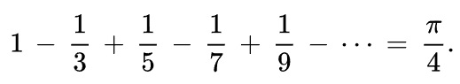

# Đề thực hành lớp python lần 2


## 1. Cho một mảng gồm N số tự nhiên
Hãy viết một hàm tham số đầu vào là một mảng các số tự nhiên trả về một mảng gồm các
ký tự + hoặc - hay = mô tả phần tử tiếp theo tăng hay giảm hay bằng so với phần tử trước đó

```sign =  "+" if A[i+1] > A[i] else "-" if A[i+1] < A[i] else "="```
Ví dụ:
m = [1, 4, 4, 2, 3, 6, 7, 8, 5, 5]
def inc_or_dec(array):->[String]

Kết quả trả về sẽ là ['+', '=', '-', '+', '+', '+', '+', '-', '=']

## 2. Tính số PI
Hãy viết chương trình tính xấp xỉ của số Pi bằng công thức này


Gợi ý hãy sử dụng 1 vòng lặp for là đủ

## 3. Đọc và xử lý file *.csv
Cho file [sales100.csv](sales100.csv) hãy đọc file này và trả về các kết quả sau đây:

1. Liệt kê tất cả các region, sắp xếp A-Z và chỉ hiển thị mỗi region một lần.
2. Tương tự liệt kê tất cả các item type, sắp xếp A-Z và chỉ hiển thị mỗi region một lần.
3. Tính tổng doanh thu Total Revenue của item type "Baby Food" trên tất cả các dòng
4. Đối với từng item type, sau khi sắp xếp A-Z hãy tính tổng doanh thu TotaRevenue