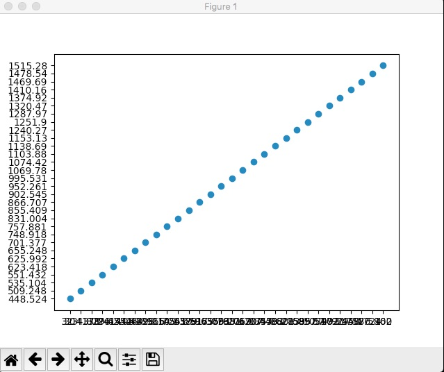
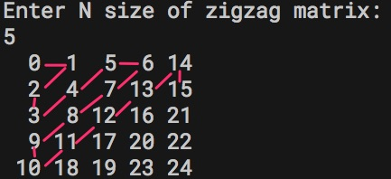

# Đề thực hành lớp python lần 3

##1. Vẽ đồ thị

Đây là một ví dụ vẽ đồ thị scatter
```python
import numpy as np
import matplotlib.pyplot as plt

# Fixing random state for reproducibility
np.random.seed(19680801)


N = 50
x = np.random.rand(N)
y = np.random.rand(N)
colors = np.random.rand(N)
area = (30 * np.random.rand(N))**2  # 0 to 15 point radii

plt.scatter(x, y, s=4, c='red')
plt.show()
```

Yêu cầu: Hãy đọc dữ liệu từ file CSV [data.csv](data.csv) rồi vẽ đồ thị


Chú ý không được dùng pandas hay thư viện khác ngoài csv

##2. Vẽ ma trận kiểu gọt dứa



Code viết bằng Swift đã có sẵn [zigzag.swift](zigzag.swift) hãy đọc để chuyển sang Python

##3.