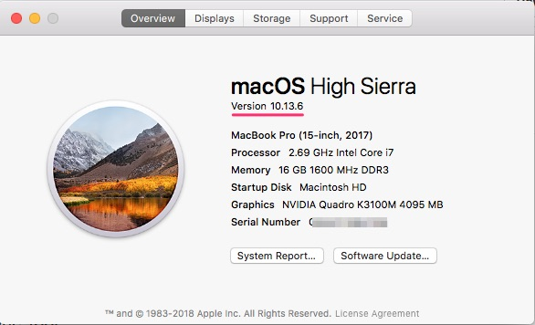

## Hướng dẫn cài đặt môi trường làm việc với iOS và swift

1. Cài đặt Xcode (tối thiểu version 10.1, Swift 4.2)
   - Hệ điều hành MacOS phải là phiên bản 10.13.6 hoặc mới hơn
   - Download Xcode từ AppStore hoặc từ trang web Developer của Apple
   - Chạy file .dmg vừa donwload
	
	
2. Cài đặt Swift Command line Tool
   - Đối với MacOS bản Mojave thì Xcode sẽ thiếu một thư viện có tên là Swift_5_Runtime_Support_for_Command_Line_Tools
   - Vào trang [https://developer.apple.com/download/more/](https://developer.apple.com/download/more/) để tải về
   - Sau đó chạy file .dmg vừa donwload
   - 

3. Cài đặt Homebrew
   - [Cài đặt Homebrew ở đây](https://brew.sh/) hoặc copy dòng lệnh dưới và chạy trong terminal
   
  `/usr/bin/ruby -e "$(curl -fsSL https://raw.githubusercontent.com/Homebrew/install/master/install)"`
   
4. Cài đặt CocoaPods

   - Vào terminal gõ dòng lệnh

     `sudo gem install cocoapods`

5. Cài đặt PyCharm Community

   - [Download PyCharm ở đây: ](https://www.jetbrains.com/pycharm/download/#section=mac)
   - Sau đó chạy file .dmg vừa download

6. Cài đặt Python 3.7.3

   - Vào terminal gõ dòng lệnh:

     `brew install python3`

   - Kiểm tra version:

     `python3 -v`

7. Cài đặt SketchApp

   - [Download SketchApp ở đây: ](https://download.com.vn/mac/sketch-for-mac/download)
   - Sau đó chạy file .dmg vừa donwload

8. Cài đặt Zalo

   - [Download Zalo ở đây: ](https://zalo.me/pc )
   - Sau đó chạy file .dmg vừa donwload

9. Đăng kí tài khoản Apple Developer Account free

   - [Tạo một Apple Id  ở đây](https://appleid.apple.com/account?appId=632&returnUrl=https%3A%2F%2Fdeveloper.apple.com%2Fregister%2Fagree%2F#!&page=create)
   - [Đăng nhập với Apple Id vừa tạo  ở đây](https://idmsa.apple.com/IDMSWebAuth/signin?appIdKey=891bd3417a7776362562d2197f89480a8547b108fd934911bcbea0110d07f757&path=%2Fregister%2Fagree%2F&rv=1) và nhấn nút Submit đồng ý với các điều khoản của Apple, như vậy là hoàn thành việc tạo tài khoản Apple Developer
